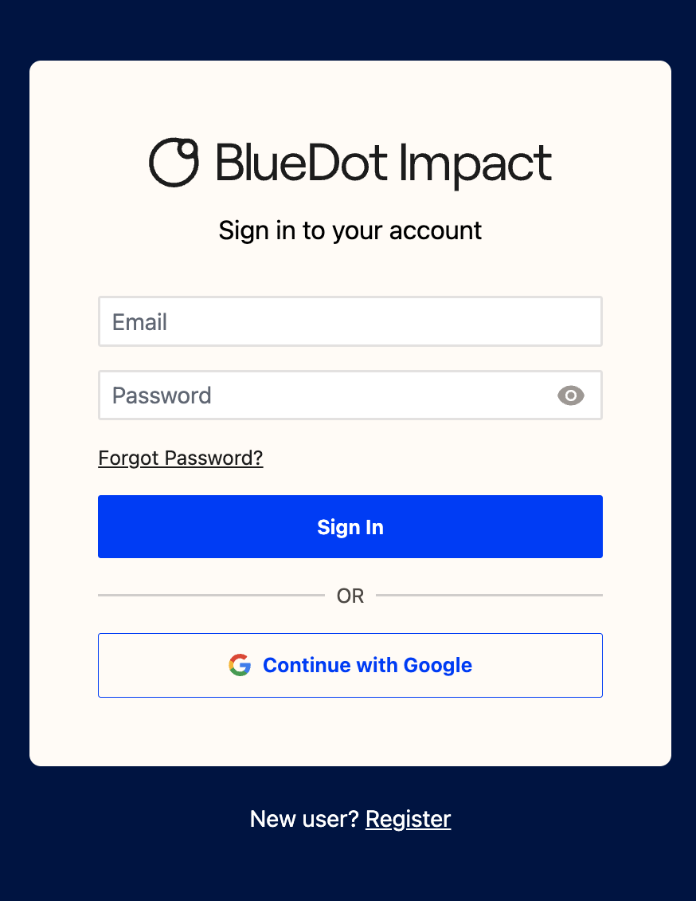
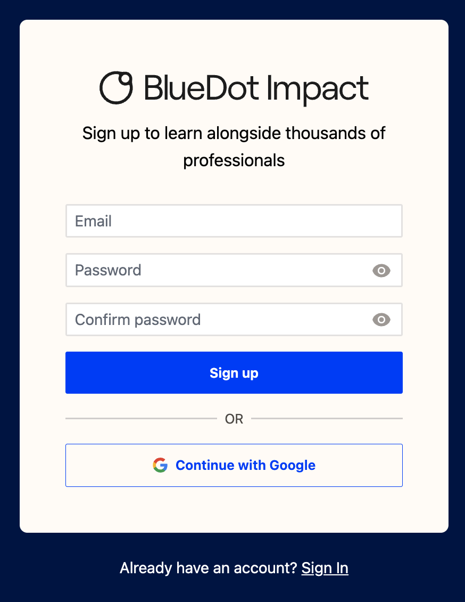
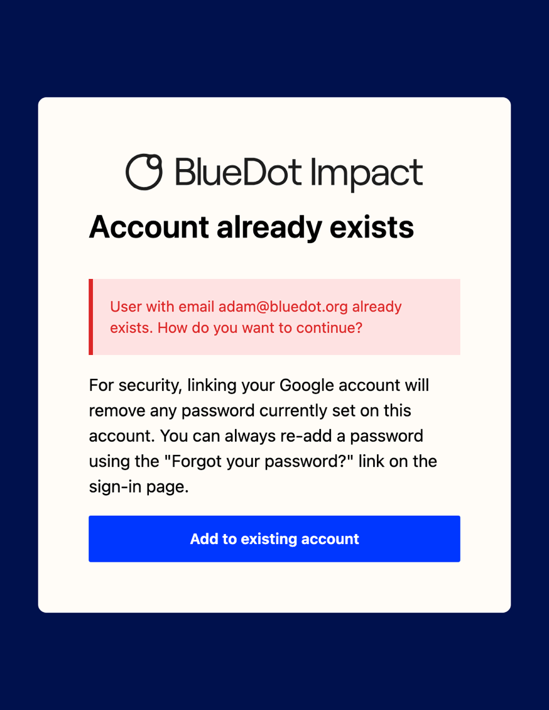
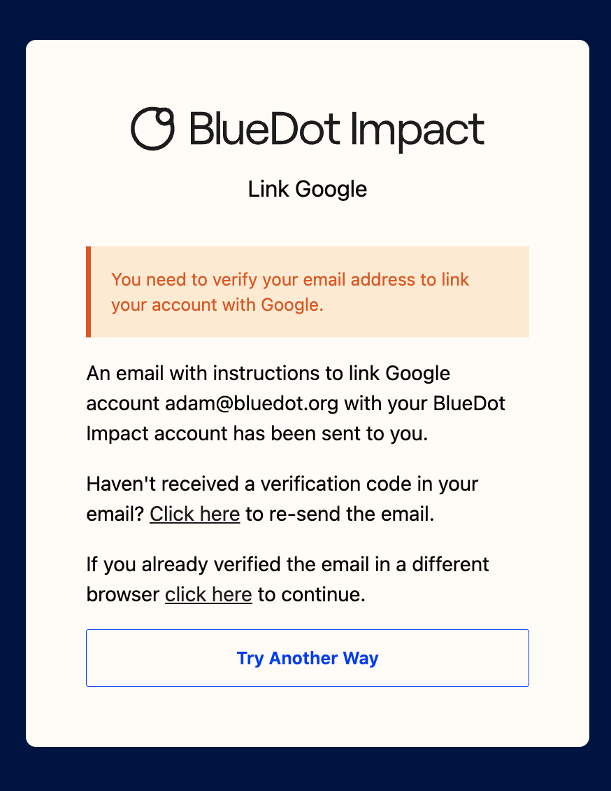
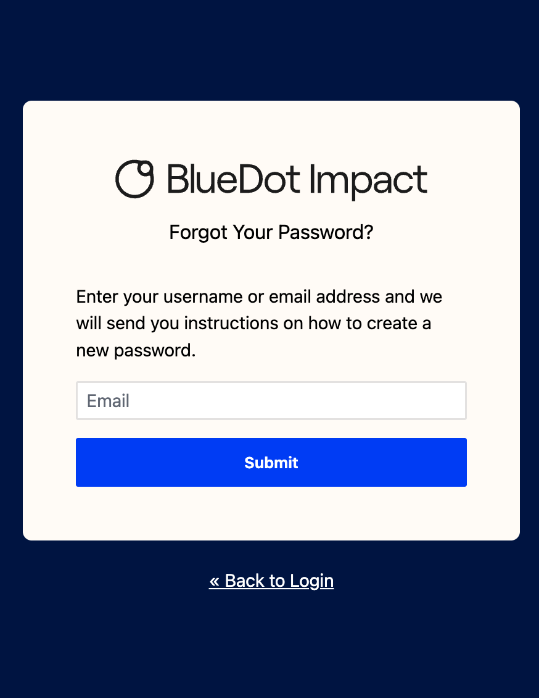

# bluedot-keycloak-theme

_This theme used to live in a separate repo, [bluedot-keycloak-theme](https://github.com/bluedotimpact/bluedot-keycloak-theme) (archived). This folder was vendored from that repo._

A component-based Keycloak login theme built with [Tailwind CSS](https://github.com/tailwindlabs/tailwindcss) and [Alpine.js](https://github.com/alpinejs/alpine). It's a fork of [Keywind](https://github.com/lukin/keywind), and is licensed under Apache-2.0 (see [`LICENSE`](./LICENSE)).

| | |
|:-------------------------:|:-------------------------:|
| **Login** | **Registration** |
|  |  |
| **IdP Linking Warning** | **IdP Linking via Email** |
|  |  |
| **Password Reset** | |
|  | |

We're taking a 'good enough' approach to theming here. Notably:
- We have not set up custom fonts
- We are not using our React component library (because Keycloak wants weird ftl templates)
  - We decided not to use [Keycloakify](https://www.keycloakify.dev/) as this looked far more complex, and more work to edit from than Keywind

List of styled pages

- Error
- Login
- Login Config TOTP
- Login IDP Link Confirm
- Login IDP Link Email
- Login OAuth Grant
- Login OTP
- Login Page Expired
- Login Password
- Login Recovery Authn Code Config
- Login Recovery Authn Code Input
- Login Reset Password
- Login Update Password
- Login Update Profile
- Login Username
- Login X.509 Info
- Logout Confirm
- Register
- Select Authenticator
- Terms and Conditions
- WebAuthn Authenticate
- WebAuthn Error
- WebAuthn Register

## Editing the theme

1. Edit files in `login/`, in particular the `components/` subfolder. Scripts and styles bundled by Vite live in this folder (`index.ts`, `index.css`, `data/`).
2. Run `npm run build` from `apps/login` to bundle the scripts and styles into `login/resources/dist/`. The [Dockerfile](../Dockerfile) packages this folder into the same jar as the custom providers, which goes in Keycloak's `providers` folder.

The theme name in `META-INF/keycloak-themes.json` must stay `bluedot-keycloak-theme`, because the production realm's login theme is set to that name.

## Previewing the theme locally

1. If you haven't already, install Postgres and create the database:
   1. `brew install postgresql@17 && brew services start postgresql@17`
   2. `echo 'export PATH="/opt/homebrew/opt/postgresql@17/bin:$PATH"' >> $HOME/.zshrc`
   3. `/opt/homebrew/opt/postgresql@17/bin/createuser -s postgres`
   4. `psql -U postgres -c "ALTER USER postgres PASSWORD 'postgres';"`
   5. `psql -U postgres -c 'create database "bluedot-login";'`
2. Uncomment the local development `ENV` lines at the bottom of the [Dockerfile](../Dockerfile) (don't commit this)
3. Run `npm run start` from `apps/login`. This builds the theme and starts Keycloak at http://localhost:8000
4. Log in to the admin console with username `admin` and password `admin`
5. Navigate to 'Realm settings > Themes', and set the 'Login theme' to 'bluedot-keycloak-theme'
6. To show the BlueDot Impact logo, set the realm's HTML display name (under 'Realm settings > General') to 'BlueDot Impact'
7. Log out to see the themed login flow
